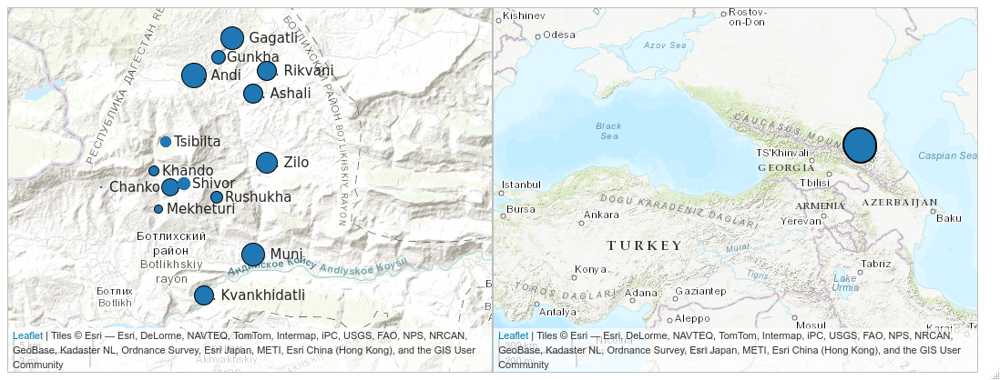

```{r setup, include=FALSE}
knitr::opts_chunk$set(echo = FALSE, warning = FALSE, message = FALSE, dev='cairo_pdf')
options(tinytex.verbose = TRUE)

library(tidyverse)
library(extrafont)
theme_set(theme_bw()+theme(text = element_text(size = 20, family = "Brill")))
```

# \color{colorwhite} Corpora of Linguistic Convergence Laboratory

# \color{colorwhite} Developing the corpus of Andi

## The Andi Language: a sociolinguistic background

< Avar-Andic < East Caucasian, glottocode [andi1255]
spoken in several villages of the Botlikh district of Dagestan. 
more than 20,000 speakers of Andi (@aglarov02, All-Russian National Census 2010)
Andi speakers are trilingual in Andi, Avar and Russian
Avar serves as a lingua franca and is taught in school (Dobrushina et al. 2017)




Created with `lingtypology` [@moroz2017]

\setcounter{footnote}{0}

## Andic data

|                      |            Andi           |     Rikvani     |    Gagatli   |     Zilo     |
|----------------------|:-------------------------:|:---------------:|:------------:|:------------:|
| materials            | [@kibrik1988; @alekseev99] | [@suleymanov57] | [@salimov10] | [@kayefurth] |
| grammar sketch       |             +             |        +        |       +      |       +      |
| dictionary           |             +             |        -        |       ±      |       ±      |
| morphological parser |±\footnote[frame]{A pilot version of a morpholoical parser of Andi is presented in (Buntyakova 2022).}             |        -        |       -      |       -      |

\setcounter{footnote}{0}

## Andic data

- How many hours do we have?
- How many is annotated?

## Problems

- Andi has several dialects and no cross-dialectal standard;
    - no full-fledged dictionary 
    - no full-fledged grammatical parser (though see a first attempt in [@buntyakova22])
- Our recorded data are heterogeneous 
    - different dialects
    - different conventions 
    - different file formats 
- Due to our limited knowledge of the Andi dialects, sometimes we do not know what the correct analysis of a given word form is.
 
## Solutions

The material has to be converted to a singular format using `phonfieldwork` [@moroz20]. For the Andi dialectal corpus the pipeline is as follows: 

- we preprocess the annotation files, converting them to ELAN `.eaf` format [@wittenburg06], 
- align them with the sound
- gloss them manually or correct mistakes and ambiguities left by morphological parser
- publish online using the Tsakorpus platform (Arkhangelskiy 2019)
- repeat all previous steps

# \color{colorwhite} Conclusions

## Conclusions:

# References {.allowframebreaks}
