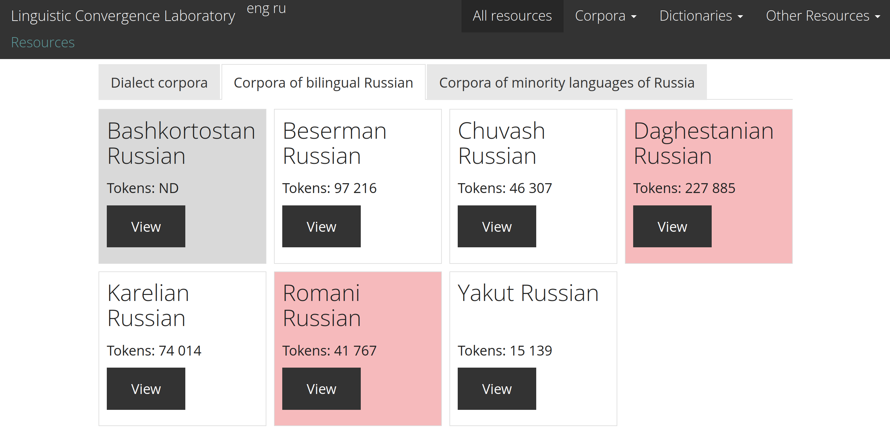
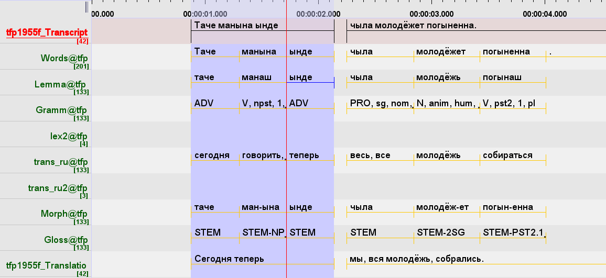

```{r setup, include=FALSE}
knitr::opts_chunk$set(echo = FALSE, warning = FALSE, message = FALSE, dev='cairo_pdf')
options(tinytex.verbose = TRUE)
```

## Outline of the talk

- Corpora of Linguistic Convergence Laboratory
- An example of Meadow Mari corpus
- Andi language and its data
- Our path towards the corpus

# \color{colorwhite} Corpora of Linguistic Convergence Laboratory

## Corpora of Linguistic Convergence Laboratory: http://lingconlab.ru/

* Russian Dialect corpora (14)
* Corpora of Bilingual Russian (7)
* Corpora of minority languages of Russia (6)

## Corpora of Linguistic Convergence Laboratory: http://lingconlab.ru/

```{r, out.width="88%"}
knitr::include_graphics("images/02_dialect_corpora.png")
```

## Corpora of Linguistic Convergence Laboratory: http://lingconlab.ru/

```{r, out.width="100%"}

```

## Corpora of Linguistic Convergence Laboratory: http://lingconlab.ru/

```{r, out.width="100%"}
knitr::include_graphics("images/04_minority_languages.png")
```

## Example of [Meadow Mari corpus](http://lingconlab.ru/spoken_meadow_mari/)

```{r, out.width="85%"}

```

## Example of [Meadow Mari corpus](http://lingconlab.ru/spoken_meadow_mari/)

- translation
- glosses
- audio/video
- export to `.xlsx`
- sociolinguistic information

## Example of required ELAN `.eaf` file

```{r, out.width="100%"}

```

- hierarchy of tiers
- time alignment
- stem forms

# \color{colorwhite} Developing the corpus of Andi

## The Andi Language: a sociolinguistic background

- Andic < Avar-Andic < East Caucasian, glottocode [andi1255]
- spoken in several villages of the Botlikh district of Dagestan. 
- more than 20,000 speakers of Andi [@aglarov02; All-Russian National Census 2010]
- Andi speakers are trilingual in Andi, Avar and Russian
- Avar serves as a lingua franca and is taught in school [@dobrushina17]


Created with `lingtypology` [@moroz2017]

\setcounter{footnote}{0}

## Andic data

|                      |            Andi           |     Rikvani     |    Gagatli   |     Zilo     |
|----------------------|:-------------------------:|:---------------:|:------------:|:------------:|
| sources              | [@kibrik88; @alekseev99; @dirr06; @tsertsvadze65];| [@suleymanov57] | [@salimov10] | [@kayefurth] |
| grammar sketch       |             +             |        +        |       +      |       +      |
| dictionary           |             +             |        -        |       ±      |       ±      |
| morphological parser |±\footnote[frame]{A pilot version of a morphological parser of Andi is presented in (Buntyakova 2022).}             |        -        |       -      |       -      |

\setcounter{footnote}{0}

## Andic data

- Written texts from grammar sketches, some with translation
- Field recordings from 1 trip to Rikvani, a few trips to Muni and Kwankhidatli, and several trips to Zilo
- Especially the Kwankhidatli dialect is endangered; only known record is a few short texts in [@tsertsvadze65]
\pause
- Recordings were made my different researchers, with different approaches to recording and processing
\pause
- We have approximately 8.27 hours of recordings
    - 7.77 hours is transcribed
    - 3 hours are aligned with sound
    - 17.35 minutes are fully glossed

## Problems

- Andi has several dialects and no cross-dialectal standard;
    - no full-fledged dictionary 
    - no full-fledged grammatical parser (though see a first attempt in [@buntyakova22])
- Our recorded data are heterogeneous 
    - different dialects
    - different conventions 
    - different file formats 
- Due to our limited knowledge of the Andi dialects, sometimes we do not know what the correct analysis of a given word form is.
 
## Solution

The material has to be converted to a singular format using `phonfieldwork` [@moroz20]. For the Andi dialectal corpus the pipeline is as follows: 

- we preprocess the annotation files, converting them to ELAN `.eaf` format [@wittenburg06], 
- align them with the sound
- gloss them manually or correct mistakes and ambiguities left by morphological parser
- publish online using the Tsakorpus platform [@arkhangelskiy19]
- repeat all previous steps

# \color{colorwhite} Conclusions

## Conclusions:

# \color{colorwhite} Thank you for your attention!

# References {.allowframebreaks}
